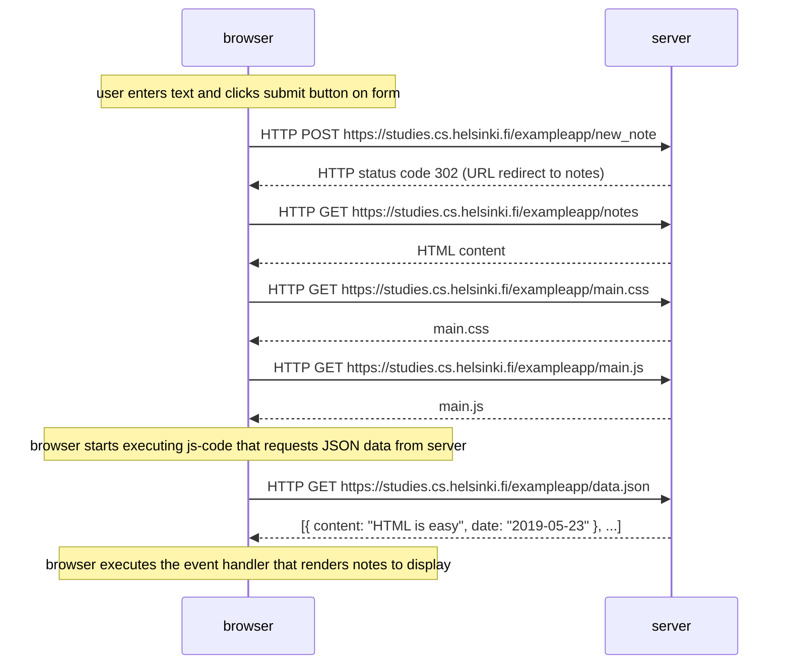
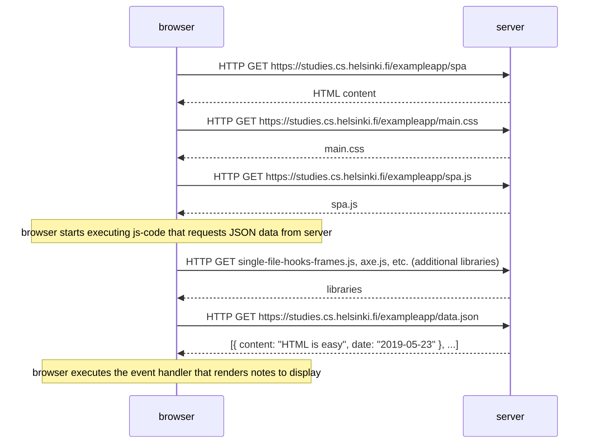
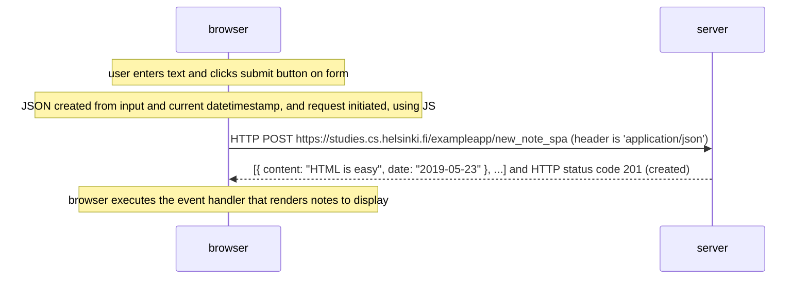

# Exercises

## 0.4 Sequence diagram for a standard HTML POST request

## 0.5 Sequence diagram when navigating to the single page application (SPA)

## 0.6 Sequence diagram for the single page application (SPA) HTML POST request
